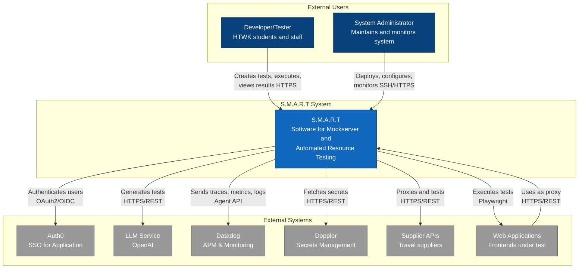

# Level 1: System Context

The System Context diagram shows the S.M.A.R.T system as a black box, focusing on the relationships between the system, its users, and external systems.

## Diagram

See [system-context.mmd](diagrams/system-context.mmd) for the Mermaid source.

## System: S.M.A.R.T

**S.M.A.R.T** (Software for Mockserver and Automated Resource Testing) is an LLM-powered automated testing platform for modern web frontends.

**Primary Purpose:**
- Enable developers and testers to create automated frontend tests using natural language
- Provide proxy services for travel/supplier API testing
- Execute tests against web applications using Playwright

## Actors

### Developers & Testers (Check24)
**Type:** Person
**Description:** Students and staff at Check24 who use S.M.A.R.T to create and run automated tests

**Interactions:**
- Access web UI to chat with LLM for test creation
- Review and validate generated tests
- Execute tests against target applications
- View test results and reports

### System Administrators
**Type:** Person
**Description:** Maintain and monitor the S.M.A.R.T system

**Interactions:**
- Deploy and configure services
- Monitor system health via Datadog
- Manage secrets via Doppler

## External Systems

### Auth0 (SSO for Application)
**Type:** External Authentication System
**Technology:** Auth0
**Description:** Provides single sign-on authentication for application users

**Interactions:**
- Frontend authenticates users via Auth0
- Issues JWT tokens for authenticated sessions
- **Note:** Only used for service-to-service communication (MCP ↔ Autotester)

### OpenAI / LLM Service
**Type:** External AI Service
**Technology:** OpenAI API (GPT models)
**Description:** Large Language Model service for test generation and chat responses

**Interactions:**
- S.M.A.R.T sends user prompts and context
- LLM generates test code, validation logic, and responses
- Supports test creation through natural language

### Datadog
**Type:** External Monitoring Service
**Technology:** Datadog APM & Logs
**Description:** Application Performance Monitoring and log aggregation

**Interactions:**
- S.M.A.R.T services send traces and metrics
- Provides observability and alerting
- Enables performance analysis

### Doppler
**Type:** External Secrets Management
**Technology:** Doppler
**Description:** Centralized secrets and configuration management

**Interactions:**
- Services fetch API keys and credentials at startup
- Environment-specific configuration (dev, prod)

### Supplier Systems (Travel APIs)
**Type:** External Business Systems
**Technology:** HTTP/REST APIs
**Description:** External travel supplier APIs providing hotel, flight, and package tour data

**Interactions:**
- S.M.A.R.T (Suproxy) forwards requests from frontend to suppliers
- Transforms and validates requests/responses
- Used for integration testing scenarios

### Web Applications Under Test
**Type:** External Frontend Applications
**Technology:** Various (e.g., Svelte, React, Vue)
**Description:** Modern web frontends that S.M.A.R.T tests via Playwright

**Interactions:**
- S.M.A.R.T executes automated tests against these applications
- Playwright browser automation interacts with UI
- Test results are captured and reported

## Key Relationships

1. **User Authentication Flow**
   - Developers → Auth0 → S.M.A.R.T Frontend
   - Auth0 provides SSO for application users

2. **Test Creation Flow**
   - Developers → S.M.A.R.T → LLM Service → S.M.A.R.T
   - Natural language prompts generate executable tests

3. **Test Execution Flow**
   - S.M.A.R.T → Web Applications Under Test
   - Playwright-based automated testing

4. **Proxy Flow**
   - Web Applications Under Test → S.M.A.R.T (Suproxy) → Supplier Systems
   - Request/response transformation and routing

5. **Observability**
   - S.M.A.R.T → Datadog
   - Continuous monitoring and tracing

6. **Configuration & Secrets**
   - S.M.A.R.T → Doppler
   - Secure credential management

## Data Flows

### Inbound
- User authentication requests (Auth0)
- User chat messages and test requests
- Test execution requests
- Proxy requests from web applications under test

### Outbound
- LLM API calls for test generation
- Test execution via browser automation
- Supplier API requests
- Monitoring data to Datadog
- Configuration pulls from Doppler

## Security Boundaries

- **Frontend Authentication:** Auth0 SSO for application users
- **Internal Services:** Network-level isolation within Docker
- **External APIs:** Secured via API keys from Doppler
- **Supplier Access:** Controlled proxy with request validation

## Technology Summary

- **Primary Language:** Go (backend services)
- **Frontend:** Svelte + TypeScript
- **Test Automation:** Playwright
- **Databases:** PostgreSQL, Redis/Valkey
- **Deployment:** Docker Compose
- **Configuration:** Pkl (type-safe config)
