# Level 2: Container

The Container diagram zooms into the S.M.A.R.T system to show the high-level technology choices and how responsibilities are distributed across containers (applications, services, databases).

## Diagram

See [containers.mmd](diagrams/containers.mmd) for the Mermaid source. The SVG is generated from it (see [Regenerating SVGs](../README.md#regenerating-svgs) in the architecture README).

## Containers Overview

### 1. Autotester Service
**Technology:** Go, Gin Framework  
**Port:** 8081  
**Repository:** `cmd/autotester/`

**Responsibilities:**
- Provides REST API for test automation
- Chat interface for LLM-based test creation
- Test execution via Playwright integration
- User and chat session management
- Test result storage and retrieval

**Key Endpoints:**
- `POST /api/v1/chat` - Chat with LLM for test creation
- `POST /api/v1/validate` - Validate test prompts
- `POST /api/v1/auth/generate` - Internal auth token generation (restricted)
- Test execution endpoints

**Dependencies:**
- PostgreSQL (persistent storage)
- Redis (caching, sessions)
- S3 / object storage (Parquet: chats, testcases, groups)
- LLM Service (via HTTP)
- Playwright (embedded)

**Configuration:** `configs/autotester.pkl`

---

### 2. Autotester MCP
**Technology:** Go, Model Context Protocol  
**Port:** 8084  
**Repository:** `cmd/mcp/`

**Responsibilities:**
- Implements Model Context Protocol server
- Bridges between LLM and Autotester service
- Exposes tools/functions for LLM to call
- Manages context and state for LLM interactions

**Key Features:**
- Tool registry for LLM-callable functions
- Internal authentication with Autotester
- Protocol adapter for MCP specification

**Dependencies:**
- Autotester Service (via HTTP)

**Configuration:** `configs/mcp.pkl`

---

### 3. Suproxy Service
**Technology:** Go, Gin Framework  
**Port:** 8080  
**Repository:** `cmd/suproxy/`

**Responsibilities:**
- Proxy between web applications under test and supplier systems
- Request/response transformation
- Header and body manipulation
- Tag processing
- Destination routing

**Key Endpoints:**
- `POST /api/v1/Offerlist` - Proxy offerlist requests

**Dependencies:**
- Supplier Systems (external)
- S3 / object storage (Parquet taglists)
- Redis (optional caching)

**Configuration:** `configs/suproxy.pkl`

---

### 4. Web Frontend
**Technology:** Svelte, TypeScript  
**Port:** (served by application servers)  
**Repository:** `web/`

**Responsibilities:**
- User interface for test creation and management
- Chat interface for LLM interaction
- Test result visualization
- User authentication flow

**Key Components:**
- Chat interface
- Test manager
- Result viewer
- Authentication module

**Dependencies:**
- Autotester Service (via REST API)
- Auth0 (authentication)

---

### 5. Nginx Reverse Proxy
**Technology:** Nginx  
**Configuration:** `deployments/nginx/default.conf`

**Responsibilities:**
- Request routing to backend services
- TLS termination (in production)
- Security layer for sensitive endpoints
- Load balancing (if scaled)

**Security Rules:**
- `/api/v1/auth/generate` restricted to internal networks only
- Nginx CIDR: 127.0.0.1, 172.16.0.0/12, 192.168.0.0/16
- Application middleware CIDR: 127.0.0.0/8, ::1/128, 10.89.0.0/8 (Podman), 172.16.0.0/12 (Docker)

---

### 6. PostgreSQL Database
**Technology:** PostgreSQL 17 Alpine  
**Port:** 5432  
**Image:** `postgres:17-alpine`

**Responsibilities:**
- Token management (storage and validation of internal auth tokens)

**Schema Management:** SQLC (`sqlc.yaml`)

---

### 7. Redis/Valkey
**Technology:** Valkey (Redis-compatible)  
**Image:** `valkey/valkey:alpine`

**Responsibilities:**
- Session management
- Caching layer
- Temporary data storage
- Rate limiting data

---

### 8. S3 / Object Storage
**Technology:** AWS S3 or S3-compatible (e.g. MinIO)  
**Configuration:** Via Doppler (endpoint, bucket, credentials)

**Responsibilities:**
- Parquet file storage for Autotester: chats, testcases, groups, media
- Parquet taglist storage for Suproxy (central taglist lookup)
- S3 API (PutObject, GetObject, ListObjectsV2, DeleteObject)

**Consumers:**
- Autotester (chatStorage, testcaseStorage, groupStorage, mediaStorage)
- Suproxy (tagSearchService)

---

### 9. Mock Services

#### Frontend Mock
**Technology:** Node.js/Svelte  
**Port:** 8082  
**Image:** `gitlab.dit.htwk-leipzig.de:5050/.../frontend-mock`

**Purpose:** Mock frontend application for testing Suproxy integration

#### Supplier Mock
**Technology:** Go, Gin Framework  
**Port:** 8083  
**Image:** `gitlab.dit.htwk-leipzig.de:5050/.../supplier-mock`

**Purpose:** Mock supplier API for testing without external dependencies

---

### 10. Datadog Agent
**Technology:** Datadog Agent  
**Ports:** 8126 (APM), 8125 (StatsD)  
**Image:** `datadog/agent:latest`

**Responsibilities:**
- Collect APM traces from services
- Aggregate metrics and logs
- Forward to Datadog cloud
- Container monitoring

---

## Container Communication

### Internal Network Communication
All services communicate via Docker internal network:
- Service discovery by container name
- No external exposure except via Nginx

### Authentication Flow
1. User → Frontend → Auth0 (OAuth)
2. Frontend → Autotester (with Auth0 token)
3. Token for MCP: obtained via Frontend (user calls `/auth/generate` from allowed networks); token is passed to MCP at startup and sent by MCP in the `Authorization` header on every request to Autotester.

### Test Creation Flow

**Via Frontend:**
1. User → Frontend (chat message)
2. Frontend → Autotester (`/validate` then `/chat`)
3. Autotester → LLM Service (prompt)
4. LLM → Autotester (generated test code)
5. Autotester → Frontend (response)

**Via MCP (e.g. Cursor/IDE):**
1. User → MCP Client (e.g. Cursor) ↔ MCP (tool calls)
2. MCP → Autotester (API: `/validate`, `/chat`; MCP does not call LLM directly)
3. Autotester → LLM Service (prompt, generated code)
4. Autotester → MCP (result)
5. MCP returns result to MCP Client

### Test Execution Flow

**Via Frontend:**
1. Frontend → Autotester (execute test request)
2. Autotester → Playwright (browser automation)
3. Playwright → Web Application Under Test
4. Playwright → Autotester (results)
5. Autotester → S3 (store results)
6. Autotester → Frontend (test results)

**Via MCP:**
1. LLM client → MCP (execute-test tool call)
2. MCP → Autotester (execute API)
3. Autotester → Playwright → Web App Under Test
4. Playwright → Autotester (results)
5. Autotester → S3 (store results)
6. Autotester → MCP → LLM client (test results)

### Proxy Flow
1. Web Application Under Test → Nginx
2. Nginx → Suproxy
3. Suproxy → Supplier APIs
4. Supplier APIs → Suproxy → Nginx → Web Application Under Test

## Technology Stack Summary

| Container | Language | Framework | Port | Storage / DB |
|-----------|----------|-----------|------|--------------|
| Autotester | Go | Gin | 8081 | PostgreSQL, Redis, S3 |
| Autotester MCP | Go | Go MCP | 8084 | - |
| Suproxy | Go | Gin | 8080 | Redis (optional), S3 |
| Frontend | TypeScript | Svelte | - | - |
| Nginx | - | Nginx | 80/8081 | - |

## Deployment

### Development
- Docker Compose: `deployments/compose.dev.yml`
- Live reload with Air
- Direct port mappings for debugging

### Production
- Docker Compose: `deployments/compose.prod.yml`
- All services behind Nginx
- No direct external port exposure
- Environment-specific configuration via Doppler

## Configuration Management

All services use **Pkl** (Apple's configuration language) for type-safe configuration:
- `configs/autotester.pkl`
- `configs/mcp.pkl`
- `configs/suproxy.pkl`
- `configs/shared/taglist.pkl`

## Security Considerations

1. **Network Isolation:** Services communicate only via internal Docker network
2. **Endpoint Protection:** `/auth/generate` restricted by Nginx and application middleware
3. **Secret Management:** All secrets stored in Doppler, never in code
4. **Authentication:** Auth0 for frontend, internal tokens for service-to-service
5. **Observability:** All services traced via Datadog for security monitoring
