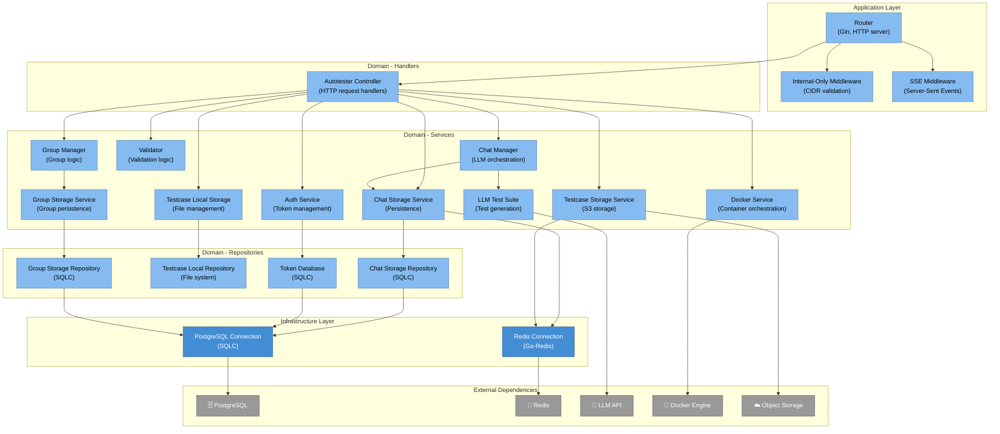

# Level 3: Autotester Components

The Autotester service is the core of S.M.A.R.T, responsible for LLM-powered test creation, execution, and management. This document describes its internal component structure.

## Diagram

See [autotester.mmd](diagrams/autotester.mmd) for the Mermaid source.

## Architecture Overview

The Autotester follows a layered architecture:
- **Application Layer**: Router, middleware, HTTP configuration
- **Domain Layer**: Handlers, services, repositories, entities
- **Infrastructure Layer**: Database access, external API clients

## Components

### Application Layer

#### Router (`application/router.go`)
**Responsibilities:**
- HTTP server initialization
- Route registration and configuration
- Middleware setup (CORS, recovery, Datadog tracing)
- Static file serving (frontend assets)

**Key Routes:**
- `POST /api/v1/chat` - Chat with LLM
- `POST /api/v1/validate` - Validate prompts
- `POST /api/v1/run` - Execute tests
- `POST /api/v1/auth/generate` - Generate internal tokens
- `GET /api/v1/tests` - List tests
- `GET /api/v1/chats` - List chat sessions
- `GET /api/v1/groups` - List test groups

#### Internal-Only Middleware
**Responsibilities:**
- CIDR-based IP validation
- Protects sensitive endpoints (`/auth/generate`)
- Blocks external access attempts

**Allowed Networks:**
- `127.0.0.0/8` - Localhost
- `::1/128` - IPv6 localhost
- `172.16.0.0/12` - Docker bridge
- `192.168.0.0/16` - Docker Compose

#### SSE Middleware
**Responsibilities:**
- Server-Sent Events header configuration
- Real-time log streaming for test execution

---

### Domain Layer - Handlers

#### AutotesterController (`domain/handler/`)
**Responsibilities:**
- HTTP request/response handling
- Request validation and binding
- Coordinates service layer calls
- Error handling and response formatting

**Key Handler Methods:**
- `HandleChatRequest` - Process chat messages
- `HandleChatRequestValidity` - Validate prompts
- `HandleRunContainer` - Execute tests in Docker
- `HandleLogRequest` - Stream test logs (SSE)
- `HandleSaveLocalRequest` - Save tests locally
- `HandleGetRemoteTestcase` - Retrieve tests
- `HandleGenerateToken` - Generate auth tokens
- `HandleGetChats` - List user chats
- `HandleGetGroups` - List groups
- `HandleCreateGroup` - Create test groups
- `HandleAssignChatToGroups` - Assign chats to groups

---

### Domain Layer - Services

#### ChatManager (`domain/service/chatManager.go`)
**Responsibilities:**
- Chat session orchestration
- LLM communication
- Context management
- Response processing

**Dependencies:**
- LLM Service (external)
- ChatStorageService

#### ChatStorageService (`domain/service/chatStorageService.go`)
**Responsibilities:**
- Chat persistence logic
- Chat retrieval and updates
- User chat management

**Dependencies:**
- ChatStorageRepository
- PostgreSQL database

#### TestcaseLocalStorageService (`domain/service/testcaseLocalStorageService.go`)
**Responsibilities:**
- Local test storage management
- File system operations for tests
- Test template generation

**Dependencies:**
- TestcaseLocalStorageRepository

#### TestcaseStorageService (`domain/service/testcaseStorageService.go`)
**Responsibilities:**
- Remote test storage in S3/object storage
- Test versioning
- Test retrieval and listing

#### Docker Service (`domain/service/docker.go`)
**Responsibilities:**
- Docker container management for test execution
- Playwright container orchestration
- Log streaming from containers
- Container lifecycle management

**Key Operations:**
- Start Playwright containers
- Execute tests in isolated environments
- Stream logs via SSE
- Cleanup containers

#### LLM Test Suite Service (`domain/service/llmTestSuite.go`)
**Responsibilities:**
- Test generation from natural language
- Prompt engineering and construction
- LLM response parsing
- Test code extraction and validation

#### Validator Service (`domain/service/validator.go`)
**Responsibilities:**
- Prompt validation logic
- Test code validation
- Request validation

#### Auth Service (`domain/service/auth.go`)
**Responsibilities:**
- Token generation for internal services
- Token validation
- JWT handling

**Dependencies:**
- TokenDatabase (PostgreSQL)

#### GroupManager & GroupStorage (`domain/service/group*.go`)
**Responsibilities:**
- Test group management
- Group creation and assignment
- Chat-to-group associations

---

### Domain Layer - Repositories

#### ChatStorageRepository (`domain/repository/chatStorageRepository.go`)
**Responsibilities:**
- Database queries for chats
- CRUD operations on chat data
- User chat associations

**Technology:** SQLC-generated code, PostgreSQL

#### TestcaseLocalStorageRepository (`domain/repository/testcaseLocalStorageRepository.go`)
**Responsibilities:**
- File system operations for tests
- Local test persistence

#### TokenDatabase (`domain/repository/database.go`)
**Responsibilities:**
- Token storage and retrieval
- Database operations for authentication

#### GroupStorage Repository (`infrastructure/repository/groupStorage.go`)
**Responsibilities:**
- Group data persistence
- Group-chat relationship management

---

### Domain Layer - Entities

Key domain entities:
- `User` - User information
- `Chat` - Chat session data
- `ChatSummary` - Chat overview
- `ChatRequest` - Incoming chat requests
- `LLMResponse` - LLM response structure
- `RunTestRequest` - Test execution request
- `LocalSaveRequest` - Save test request
- `ContainerInfo` - Docker container metadata
- `Group` - Test group entity
- `Token` - Authentication token

---

### Infrastructure Layer

#### Database (`infrastructure/database/`)
**Technology:** PostgreSQL with SQLC
**Responsibilities:**
- Database connection management
- Query execution
- Transaction management

**Tables:**
- Users
- Chats
- Messages
- Tests
- Tokens
- Groups

**Generated Code:** SQLC generates type-safe Go code from SQL

---

### Configuration

#### Pkl Config (`domain/config/`)
**Configuration Files:**
- `Config.pkl.go` - Main config structure
- `Prompts.pkl.go` - LLM prompt templates

**Configuration Includes:**
- Server port and host
- Database connection strings
- Redis configuration
- LLM API keys (from Doppler)
- Playwright settings
- Datadog configuration

---

## Component Interactions

### Test Creation Flow
1. **Router** receives chat request
2. **AutotesterController** validates request
3. **ChatManager** orchestrates LLM interaction
4. **LLM Test Suite Service** generates test code
5. **ChatStorageService** persists chat history
6. **Response** returned to user

### Test Execution Flow
1. **Router** receives run request
2. **AutotesterController** validates
3. **Docker Service** creates Playwright container
4. **Container** executes test
5. **Docker Service** streams logs via SSE
6. **TestcaseStorageService** saves results
7. **Response** with results returned

### Authentication Flow
1. **Authenticated user** (e.g. via Frontend) calls `/auth/generate` (internal only, from allowed networks)
2. **Internal-Only Middleware** validates IP
3. **AuthController** receives request
4. **Auth Service** generates JWT token
5. **TokenDatabase** stores token
6. **Token** returned to caller

**MCP:** Does not call `/auth/generate`. Sends the bearer token in the `Authorization` header when calling Autotester (token obtained by the authenticated user, e.g. via Frontend).

### Group Management Flow
1. **Router** receives group request
2. **AutotesterController** validates
3. **GroupManager** processes request
4. **GroupStorage Service** persists data
5. **GroupStorage Repository** writes to DB

---

## Key Design Patterns

1. **Layered Architecture**: Clear separation of concerns (Application → Domain → Infrastructure)
2. **Repository Pattern**: Abstract data access through repositories
3. **Service Layer**: Business logic encapsulation
4. **Dependency Injection**: Constructor injection via Wire
5. **CQRS-lite**: Separate read/write operations
6. **Middleware Pattern**: Cross-cutting concerns (auth, logging)

## Technology Stack

- **Framework**: Gin (HTTP router)
- **Database**: PostgreSQL 17 with SQLC
- **Caching**: Redis/Valkey
- **Monitoring**: Datadog APM
- **Configuration**: Pkl
- **Testing**: Go standard testing + Mockery
- **Dependency Injection**: Wire
- **Container Runtime**: Docker API client

## Security Considerations

1. **Network-level Protection**: Internal-only middleware for sensitive endpoints
2. **Token-based Auth**: JWT for service-to-service communication
3. **Input Validation**: All requests validated before processing
4. **Database Security**: Parameterized queries via SQLC
5. **Container Isolation**: Tests run in isolated Docker containers
