# Level 3: Frontend Components

The Web Frontend provides the user interface for S.M.A.R.T, built with Svelte and TypeScript. It enables users to interact with the LLM for test creation, manage tests, and view execution results.

## Diagram

See [frontend.mmd](diagrams/frontend.mmd) for the Mermaid source. The SVG is generated from it (see [Regenerating SVGs](../README.md#regenerating-svgs) in the architecture README).

## Architecture Overview

The frontend follows a component-based architecture with Svelte:
- **Components**: Reusable UI components (no separate pages/routing layer)
- **Services**: Business logic and API communication
- **State Management**: One Svelte store (auth); otherwise Svelte 5 runes (`$state`, `$derived`) for reactive state
- **UI Library**: Shadcn/UI

## Components

### Core Application Components

#### Chat Component (`lib/components/Chat.svelte`)
**Responsibilities:**
- Main chat interface with LLM
- Message display and input
- Real-time response rendering
- Message history management

**Features:**
- LLM responses: code shown in Monaco Editor, otherwise plain text (no markdown rendering)
- Message type indicators (user, validation, generation, error)
- Response not streamed for chat; streaming only for live logs (test execution)

#### Sidebar Component (`lib/components/Sidebar.svelte`)
**Responsibilities:**
- Chat history navigation
- Chat selection and filtering
- User menu and actions
- Group management UI

**Features:**
- List of user's chats
- Create new chat
- Filter and sort options
- Group assignments

#### RunWindow Component (`lib/components/RunWindow.svelte`)
**Responsibilities:**
- Test execution interface
- Test configuration options
- Execute test button
- Real-time status updates

**Features:**
- Test parameter input
- Run test command
- Loading states
- Error handling

#### OutputView Component (`lib/components/OutputView.svelte`)
**Responsibilities:**
- Display test execution output
- Log streaming visualization
- Test results display
- Error reporting

**Features:**
- Real-time log updates (SSE)
- Syntax highlighting for logs
- Terminal-like interface
- Success/failure indicators

---

### Service Layer

#### API Service (`lib/api.ts`)
**Responsibilities:**
- Axios-based API client
- API endpoint communication
- Request/response transformation
- Error handling

**Key Functions:**
- `generatePrompt(request)` - Send chat message to `/chat`
- `validatePrompt(request)` - Validate prompt via `/validate`
- `getChats()` - Fetch user's chat history
- `getChatById()` - Get specific chat details
- `getTemplate()` - Fetch test template
- `saveTestLocal(request)` - Save test locally
- `deleteLocalTest(testcaseId)` - Delete local test
- `runContainer(request)` - Execute test in container

**Technology:** Axios client
**Base URL:** `http://localhost:8081/api/v1/`

#### Auth Service (`lib/authService.ts`)
**Responsibilities:**
- Auth0 integration
- User authentication flow
- Session management
- Token handling

**Key Functions:**
- `initAuth()` - Initialize Auth0 client
- `login()` - Trigger Auth0 login flow
- `logout()` - Log user out
- Auth state management via Svelte store

**Features:**
- OAuth redirect handling
- Callback processing
- Local storage for tokens
- User profile retrieval

---

### State Management

#### Shared State (`lib/shared.svelte.ts`)
**Responsibilities:**
- Application-wide reactive state
- User context
- Chat context
- Message history

**State Objects:**
- `messages[]` - Chat message history
- `user` - Current user ID
- `chat` - Current chat ID and loading state
- `ChatDate` - Date range for filtering
- `ChatFilter` - Filter and sort preferences

**Message Types:**
- `user` - User input
- `validation` - Validation results
- `generation` - Generated test code
- `error` - Error messages

---

### Utilities

#### Runner (`lib/runner.svelte.ts`)
**Responsibilities:**
- Test execution orchestration
- State management for test runs
- Result handling

#### Runner Log Transform (`lib/runnerlogtransform.ts`)
**Responsibilities:**
- Transform raw logs to UI format
- Parse log entries
- Format for display

#### Code Display
**Responsibilities:**
- Code display and syntax highlighting via Monaco Editor (replaces Prism.js)

#### Utils (`lib/utils.ts`)
**Responsibilities:**
- Common utility functions and helper methods (no formatting helpers)

---

### UI Component Library

The frontend includes a comprehensive UI component library under `lib/components/ui/`:

#### Layout Components
- **Window** - Modal windows and dialogs
- **Sidebar** - Collapsible sidebar navigation
- **Sheet** - Slide-out panels
- **Separator** - Visual dividers

#### Form Components
- **Input** - Text input fields
- **Textarea** - Multi-line text input
- **Button** - Action buttons
- **Button Group** - Grouped buttons
- **Label** - Form labels
- **Input Group** - Grouped form controls

#### Display Components
- **Terminal** - Terminal-style output
  - Terminal Typing Animation
  - Terminal Loop
  - Terminal Loading
- **Tooltip** - Contextual help
- **Spinner** - Loading indicators
- **Skeleton** - Loading placeholders
- **Dialog** - Modal dialogs

#### Navigation Components
- **Underline Tabs** - Tab navigation
- **Dropdown Menu** - Contextual menus

#### Feedback Components
- **Sonner** - Toast notifications

#### Date Components
- **Range Calendar** - Date range picker

---

## Component Interactions

### Authentication Flow
1. User opens application
2. **Auth Service** initializes Auth0 client
3. **Auth Service** checks authentication state
4. If not authenticated: redirect to Auth0 login
5. Auth0 returns with code/state
6. **Auth Service** handles callback
7. **Auth Service** retrieves user profile
8. **Shared State** updated with user ID
9. User redirected to main app

### Chat Interaction Flow (Test Creation)
1. User types message in **Chat Component**
2. **Chat Component** updates **Shared State** messages
3. **API Service** calls `/validate` then `/chat` (response not streamed)
4. Backend processes via LLM
5. **Chat Component** displays response (code in Monaco, else plain)
6. **Shared State** updated with new messages

### Test Execution Flow
1. User opens **RunWindow Component**
2. User configures test parameters
3. User clicks "Run Test"
4. **API Service** calls `saveTestLocal()` before `runContainer()` (save before run)
5. Backend starts Docker container
6. **OutputView Component** connects to SSE endpoint (streaming only for live logs)
7. Logs streamed in real-time
8. **OutputView** displays logs
9. Final result displayed (pass/fail)

### Chat History Flow
1. **Sidebar Component** loads
2. **API Service** calls `getChats()`
3. Backend returns chat summaries
4. **Sidebar** displays chat list
5. User clicks chat
6. **API Service** calls `getChatById()`
7. **Chat Component** loads message history
8. **Shared State** updated

---

## Key Design Patterns

1. **Component-Based Architecture**: Svelte components for reusability
2. **Service Layer**: Separation of API logic from UI
3. **Reactive State Management**: Svelte stores for app state
4. **Event-Driven**: Component communication via events
5. **Composition**: UI library built from composable components

## Technology Stack

- **Framework**: Svelte 5 (with runes for reactivity)
- **Language**: TypeScript
- **HTTP Client**: Axios
- **Authentication**: Auth0 SPA SDK
- **Styling**: Tailwind CSS
- **UI Components**: Shadcn/UI
- **Build Tool**: Vite (standard for Svelte)
- **Code Display**: Monaco Editor

## State Management Strategy

### Reactive State ($state)
Svelte 5's new runes system for reactive state:
- `$state()` - Reactive state variables
- Automatic re-renders on state changes
- No explicit stores needed for simple state

### Svelte Stores
- `auth` store - Authentication state (only store used; rest of state via Svelte 5 runes)

## Real-time Features

### Server-Sent Events (SSE)
- Test execution logs streamed in real-time
- Connection to `/test/:testId/stream` endpoint
- Automatic reconnection on disconnect
- Displayed in **OutputView Component**

## Performance Considerations

1. **Code Splitting**: Component lazy loading
2. **Virtual Scrolling**: For long chat histories
3. **Debounced Input**: For search and filter
4. **Optimized Rendering**: Svelte's reactive updates

## Security Considerations

1. **Auth0 Integration**: Secure authentication flow
2. **Token Storage**: Local storage with secure practices
3. **XSS Prevention**: Svelte's automatic escaping
4. **HTTPS Only**: In production
5. **CORS Handling**: Proper origin validation
