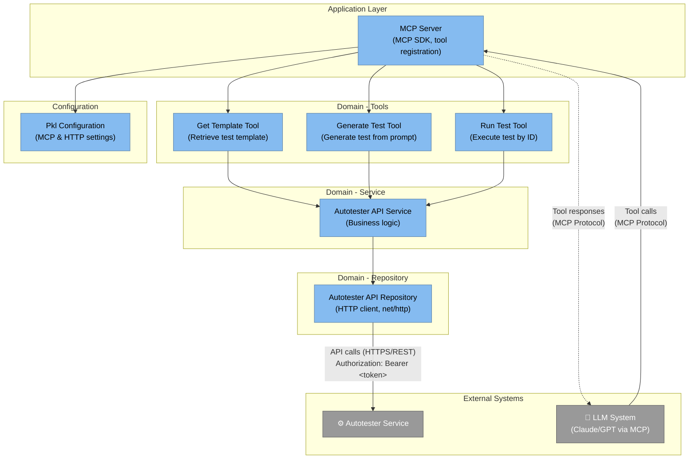

# Level 3: MCP (Model Context Protocol) Components

The Autotester MCP service implements the Model Context Protocol, enabling LLM systems to interact with the Autotester backend through structured tool calls.

## Diagram



See [mcp.mmd](diagrams/mcp.mmd) for the Mermaid source.

## Architecture Overview

The MCP service acts as a bridge between LLM systems and the Autotester backend:
- **Application Layer**: MCP server setup and tool registration
- **Domain Layer**: Tools, services, repositories
- **Protocol**: Model Context Protocol (MCP) specification

## Components

### Application Layer

#### MCP Server (`application/server.go`)
**Responsibilities:**
- MCP SDK server initialization
- Tool registration
- Request routing
- Protocol handling

**Key Methods:**
- `NewMcpServer()` - Initialize server with dependencies
- `Run(transport)` - Start server with transport layer
- `registerTools()` - Register all available tools

**Registered Tools:**
- `get_template` - Retrieve test generation template
- `generate_test` - Generate test from prompt
- `run_test` - Execute test by ID

**Transport:**
- Standard I/O (stdio) for CLI integration
- HTTP/SSE for web integration

---

### Domain Layer - Tools

#### Get Template Tool (`domain/tools/getTemplateTool.go`)
**Responsibilities:**
- Retrieve test template from Autotester
- Provide template structure to LLM
- Format template for LLM consumption

**Tool Definition:**
- **Name**: `get_template`
- **Description**: "Retrieves the test generation template from the autotester backend"
- **Parameters**: None
- **Returns**: Template string

**Implementation:**
- Calls Autotester API `/template` endpoint
- Returns template content

#### Generate Test Tool (`domain/tools/generateTestTool.go`)
**Responsibilities:**
- Accept user prompt from LLM
- Send to Autotester for test generation
- Return generated test code

**Tool Definition:**
- **Name**: `generate_test`
- **Description**: "Takes prompt, sends it to backend and receives feedback to display in frontend"
- **Parameters**:
  - `prompt` (string) - User's test description
  - `userId` (string) - User identifier
  - `chatId` (string) - Chat session ID
- **Returns**: Generated test code, validation feedback

**Implementation:**
- Validates prompt
- Calls Autotester API `/validate` or `/chat`
- Parses LLM response
- Returns structured test data

#### Run Test Tool (`domain/tools/runTestTool.go`)
**Responsibilities:**
- Execute test by test ID
- Monitor execution status
- Return test results

**Tool Definition:**
- **Name**: `run_test`
- **Description**: "Runs test based on testId, returns either success or failed"
- **Parameters**:
  - `testId` (string) - Test identifier
  - `userId` (string) - User identifier
  - `chatId` (string) - Chat session ID
- **Returns**: Test execution results (success/failure)

**Implementation:**
- Calls Autotester API `/run` endpoint
- Streams logs (optional)
- Returns execution status

---

### Domain Layer - Services

#### Autotester API Service (`domain/service/autotesterAPIService.go`)
**Responsibilities:**
- Business logic for Autotester API interactions
- Request orchestration
- Response processing
- Error handling

**Key Methods:**
- `GetTemplate()` - Fetch template
- `ValidatePrompt(request)` - Validate user prompt
- `GenerateTest(request)` - Generate test from prompt
- `ExecuteTest(request)` - Execute test
- `SaveTest(request)` - Save test locally/remotely

**Dependencies:**
- AutotesterAPIRepository

---

### Domain Layer - Repositories

#### Autotester API Repository (`domain/repository/autotesterAPIRepository.go`)
**Responsibilities:**
- HTTP client for Autotester API
- Request/response serialization
- Authentication token management
- Connection handling

**Key Methods:**
- `GetTemplate()` - GET `/template`
- `ValidatePrompt(request)` - POST `/validate`
- `GenerateTest(request)` - POST `/chat`
- `ExecuteTest(request)` - POST `/run`
- `SaveTest(request)` - POST `/saveLocal`

**Authentication:**
- Sends bearer token in `Authorization` header on every request to Autotester
- Token is provided at MCP startup (e.g. from authenticated user who obtained it via Frontend calling `/auth/generate`)
- MCP does not call `/auth/generate`

**Technology:** Go standard `net/http`

---

### Domain Layer - Entities

Key entities for MCP operations:

#### GenerateTestRequest (`domain/entity/generateTestsRequest.go`)
**Structure:**
- `Prompt` - User's test description
- `UserId` - User identifier
- `ChatId` - Chat session ID

#### GenerateTestResponse (`domain/entity/generateTestResponse.go`)
**Structure:**
- `TestCode` - Generated test code
- `ValidationResult` - Validation feedback
- `TestId` - Assigned test ID

#### RunTestRequest (`domain/entity/runTestRequest.go`)
**Structure:**
- `TestId` - Test to execute
- `UserId` - User identifier
- `ChatId` - Chat session ID

#### RunTestResponse (`domain/entity/runTestResponse.go`)
**Structure:**
- `Success` - Execution result (boolean)
- `Output` - Test output logs
- `ErrorMessage` - Error details (if failed)

#### ExecuteTestRequest & Response
Similar to RunTest but with additional execution parameters

#### SaveTestRequest (`domain/entity/saveTestRequest.go`)
**Structure:**
- `TestCode` - Test code to save
- `TestName` - Test name
- `ChatId` - Associated chat

#### TemplateResponse (`domain/entity/templateResponse.go`)
**Structure:**
- `Template` - Template content string

#### ValidateMessage (`domain/entity/validateMessage.go`)
**Structure:**
- `Prompt` - Prompt to validate
- `IsValid` - Validation result
- `Errors` - Validation errors

---

### Configuration

#### Pkl Config (`domain/config/`)
**Configuration Files:**
- `Config.pkl.go` - Main MCP configuration
- `McpServerImplementation.pkl.go` - Server implementation config
- `HttpClientConfig.pkl.go` - HTTP client settings

**Configuration Includes:**
- MCP server port (8084)
- Autotester base URL
- HTTP client timeouts
- Bearer token for Autotester API (provided at startup)
- Tool configurations

---

## Component Interactions

### Tool Invocation Flow
1. **LLM** sends tool call via MCP protocol
2. **MCP Server** receives tool call
3. **MCP Server** routes to appropriate tool
4. **Tool** (e.g., GenerateTestTool) validates parameters
5. **Tool** calls **Autotester API Service**
6. **Service** calls **Autotester API Repository**
7. **Repository** makes HTTP request to Autotester
8. **Repository** sends bearer token in `Authorization` header
9. **Response** flows back through layers
10. **MCP Server** returns to LLM via MCP protocol

### Authentication Flow
1. **Authenticated user** obtains JWT via Frontend calling `/auth/generate` (internal, IP-restricted)
2. **Bearer token** is provided to MCP at startup (e.g. via IDE/CLI configuration)
3. **Autotester API Repository** sends `Authorization: Bearer <token>` on every HTTP request to Autotester
4. **Autotester** validates the token; MCP does not call `/auth/generate`

### Test Generation Flow (via MCP)
1. **LLM** invokes `generate_test` tool
2. **Generate Test Tool** receives prompt, userId, chatId
3. **Tool** calls **Autotester API Service** `GenerateTest()`
4. **Service** calls **Repository** `GenerateTest()`
5. **Repository** POST to `/chat` endpoint
6. **Autotester** processes prompt with LLM
7. **Response** with generated test code returned
8. **Tool** formats response for MCP
9. **MCP Server** returns to LLM

### Test Execution Flow (via MCP)
1. **LLM** invokes `run_test` tool
2. **Run Test Tool** receives testId
3. **Tool** calls **Autotester API Service** `ExecuteTest()`
4. **Service** calls **Repository** `ExecuteTest()`
5. **Repository** POST to `/run` endpoint
6. **Autotester** starts Docker container
7. **Test** executes in Playwright
8. **Results** returned to Repository
9. **Tool** formats results for MCP
10. **MCP Server** returns to LLM

---

## Key Design Patterns

1. **Tool Pattern**: Each MCP tool is a self-contained component
2. **Repository Pattern**: Abstract HTTP client operations
3. **Service Layer**: Business logic separation
4. **Dependency Injection**: Constructor injection via Wire
5. **Protocol Adapter**: MCP protocol abstraction

## Technology Stack

- **MCP SDK**: Official Go SDK for Model Context Protocol
- **HTTP Client**: Go standard library
- **Configuration**: Pkl
- **Dependency Injection**: Wire
- **Monitoring**: Datadog APM

## Protocol Details

### Model Context Protocol (MCP)
- **Version**: Latest MCP specification
- **Transport**: stdio (primary), HTTP/SSE (future)
- **Message Format**: JSON-RPC style
- **Tool Schema**: JSON Schema for parameters

### Tool Definition Example
```json
{
  "name": "generate_test",
  "description": "Takes prompt, sends it to backend and receives feedback",
  "inputSchema": {
    "type": "object",
    "properties": {
      "prompt": { "type": "string" },
      "userId": { "type": "string" },
      "chatId": { "type": "string" }
    },
    "required": ["prompt", "userId", "chatId"]
  }
}
```

## Security Considerations

1. **Bearer Token**: Sent in `Authorization` header; token provided at startup (from authenticated user, not from MCP calling `/auth/generate`)
2. **Network Restriction**: MCP runs within Docker network
3. **Input Validation**: All tool parameters validated
4. **Error Handling**: Sensitive information not leaked in errors

## Future Enhancements

1. **Additional Tools**:
   - `list_tests` - List available tests
   - `update_test` - Modify existing test
   - `delete_test` - Remove test
   - `get_test_results` - Retrieve historical results

2. **Streaming Support**:
   - Stream test generation progress
   - Stream execution logs in real-time

3. **Caching**:
   - Cache templates
   - Cache common prompts

4. **Observability**:
   - Tool call metrics
   - Latency tracking
   - Error rate monitoring
