# Level 3: MCP (Model Context Protocol) Components

The Autotester MCP service implements the Model Context Protocol, enabling LLM systems to interact with the Autotester backend through structured tool calls.

## Diagram


See [mcp.mmd](diagrams/mcp.mmd) for the Mermaid source. The SVG is generated from it (see [Regenerating SVGs](../README.md#regenerating-svgs) in the architecture README).

## Architecture Overview

The MCP service acts as a bridge between LLM systems and the Autotester backend:
- **Application Layer**: MCP server setup and tool registration
- **Domain Layer**: Tools, services, repositories
- **Protocol**: Model Context Protocol (MCP) specification

## Components

### Application Layer

#### MCP Server (`application/server.go`)
**Responsibilities:**
- MCP SDK server initialization
- Tool registration
- Request routing
- Protocol handling

**Key Methods:**
- `NewMcpServer()` - Initialize server with dependencies
- `Run(transport)` - Start server with transport layer
- `registerTools()` - Register all available tools
- `registerResources()` - Register MCP resources (e.g. test log stream)

**Registered Tools:**
- `get_template` - Retrieve test generation template
- `generate_test` - Generate test from prompt
- `run_test` - Execute test (parameter is test code; saved internally then gets ID)
- `read_testLogStream` - Read test execution log stream

**Resources:**
- `read_testLogStream` - Test log stream resource

**Transport:**
- Streamable HTTP only (no stdio)

---

### Domain Layer - Tools

#### Get Template Tool (`domain/tools/getTemplateTool.go`)
**Responsibilities:**
- Retrieve test template from Autotester
- Provide template structure to LLM
- Format template for LLM consumption

**Tool Definition:**
- **Name**: `get_template`
- **Description**: "Retrieves the test generation template from the autotester backend"
- **Parameters**: None
- **Returns**: Template string

**Implementation:**
- Calls Autotester API `/template` endpoint
- Returns template content

#### Generate Test Tool (`domain/tools/generateTestTool.go`)
**Responsibilities:**
- Accept user prompt from LLM
- Send to Autotester for test generation
- Return generated test code only (no structured test data)

**Tool Definition:**
- **Name**: `generate_test`
- **Description**: "Takes prompt, sends it to backend and receives feedback"
- **Parameters**:
  - `prompt` (string) - User's test description
  - `userId` (string) - User identifier
  - `chatId` (string) - Chat session ID
- **Returns**: Test code only (or validation hints if prompt validation failed)

**Implementation:**
- Calls Autotester API `/validate` then `/chat`
- Returns only the test code (no structured test metadata)

#### Run Test Tool (`domain/tools/runTestTool.go`)
**Responsibilities:**
- Execute test; parameter is test code (saved internally via `/saveLocal`, then run)
- Monitor execution status
- Return test results

**Tool Definition:**
- **Name**: `run_test`
- **Description**: "Runs test; parameter is test code (saved internally, then executed)"
- **Parameters**:
  - `testId` (string) - Test code (saved in tool call, then receives internal ID)
  - `userId` (string) - User identifier
  - `chatId` (string) - Chat session ID
- **Returns**: Test execution results (success/failure)

**Implementation:**
- Calls Autotester API `/saveLocal` then `/run`
- Optional: `readTestLogStream()` for log streaming
- Returns execution status

#### Read Test Log Stream Tool / Resource
**Responsibilities:**
- Expose test execution log stream to LLM client
- Tool: `read_testLogStream`
- Resource template: `testlog_stream` (URI: `mcp://tests/{testId}/logs`)

---

### Domain Layer - Services

#### Autotester API Service (`domain/service/autotesterAPIService.go`)
**Responsibilities:**
- Business logic for Autotester API interactions
- Request orchestration
- Response processing
- Error handling

**Key Methods:**
- `GetTemplate()` - Fetch template
- `GenerateTest(request)` - Generate test from prompt (validation and chat calls are at repository layer)
- `RunTest(request)` - Execute test (repo layer)
- `readTestLogStream()` - Read test execution log stream (new)

**Note:** `ValidatePrompt` and `SaveTest` are not on the service layer; they are invoked at repository level (e.g. tool calls repo methods that POST to `/validate`, `/saveLocal`).

**Dependencies:**
- AutotesterAPIRepository

---

### Domain Layer - Repositories

#### Autotester API Repository (`domain/repository/autotesterAPIRepository.go`)
**Responsibilities:**
- HTTP client for Autotester API
- Request/response serialization
- Connection handling
- No token management: token is passed per request (MCP client sends it in header with each request)

**Key Methods:**
- `GetTemplate()` - GET `/template`
- `ValidatePrompt(request)` - POST `/validate` (body: string)
- `GenerateTest(request)` - POST `/chat`
- `RunTest(request)` - POST `/run` (not `ExecuteTest`; takes testId after save)
- `SaveTest(request)` - POST `/saveLocal`
- `readTestLogStream()` - Read test log stream (new)

**Request/response:**
- `ExecuteTestRequest`: receives test code as parameter; after save, run uses testId
- `RunTestRequest`: only testId (no code)
- `SaveTestRequest`: userId (not TestName)
- `ValidateMessage`: body string only; validation hints or empty if none

**Authentication:**
- Token is sent by MCP client with every request in `Authorization` header (not stored in MCP config)
- MCP does not call `/auth/generate`

**Technology:** Go standard `net/http`

---

### Domain Layer - Entities

Key entities for MCP operations:

#### GenerateTestRequest (`domain/entity/generateTestsRequest.go`)
**Structure:**
- `Prompt` - User's test description
- `UserId` - User identifier
- `ChatId` - Chat session ID

#### GenerateTestResponse (`domain/entity/generateTestResponse.go`)
**Structure:**
- `TestCode` - Generated test code
- `ValidationResult` - Validation feedback
- `TestId` - Assigned test ID

#### RunTestRequest (`domain/entity/runTestRequest.go`)
**Structure:**
- `TestId` - Test ID (after save; ExecuteTestRequest carries test code as parameter)
- `UserId` - User identifier
- `ChatId` - Chat session ID

#### RunTestResponse (`domain/entity/runTestResponse.go`)
**Structure:**
- `Success` - Execution result (boolean)
- `Output` - Test output logs
- `ErrorMessage` - Error details (if failed)

#### ExecuteTestRequest & RunTestRequest
- ExecuteTestRequest: receives test code as parameter (saved in tool, then run uses testId)
- RunTestRequest: only testId (no code)

#### SaveTestRequest (`domain/entity/saveTestRequest.go`)
**Structure:**
- `TestCode` - Test code to save
- `UserId` - User identifier (not TestName)
- `ChatId` - Associated chat

#### TemplateResponse (`domain/entity/templateResponse.go`)
**Structure:**
- `Template` - Template content string

#### ValidateMessage (`domain/entity/validateMessage.go`)
**Structure:**
- Body string (prompt to validate)
- Validation hints or empty if none

---

### Configuration

#### Pkl Config (`domain/config/`)
**Configuration Files:**
- Config file names may differ from above; see current `configs/` and `domain/config/` for actual names.

**Configuration Includes:**
- MCP server port (8084)
- Autotester base URL
- HTTP client timeouts
- Token is not in configuration; MCP client sends it in the `Authorization` header with each request
- Tool configurations

---

## Component Interactions

### Tool Invocation Flow
1. **LLM** sends tool call via MCP protocol
2. **MCP Server** receives tool call
3. **MCP Server** routes to appropriate tool
4. **Tool** (e.g., GenerateTestTool) validates parameters
5. **Tool** calls **Autotester API Service**
6. **Service** calls **Autotester API Repository**
7. **Repository** makes HTTP request to Autotester
8. **Repository** sends bearer token in `Authorization` header
9. **Response** flows back through layers
10. **MCP Server** returns to LLM via MCP protocol

### Authentication Flow
1. **Authenticated user** obtains token via Frontend calling `/auth/generate` (internal, IP-restricted)
2. **MCP client** sends the token in the `Authorization` header with every request (token not in MCP config)
3. **Autotester API Repository** forwards the token from the request header to Autotester
4. **Autotester** validates the token; MCP does not call `/auth/generate`

### Test Generation Flow (via MCP)
1. **LLM** invokes `generate_test` tool
2. **Generate Test Tool** receives prompt, userId, chatId
3. **Tool** calls **Autotester API Service** `GenerateTest()`
4. **Service** / **Repository** POST to `/validate` then `/chat`
5. **Autotester** processes prompt with LLM
6. **Response** with generated test code only returned
7. **Tool** formats response for MCP
8. **MCP Server** returns to LLM

### Test Execution Flow (via MCP)
1. **LLM** invokes `run_test` tool (parameter: test code)
2. **Run Test Tool** receives test code; calls **Repository** to save via `/saveLocal`, then run
3. **Tool** calls **Autotester API Service** `RunTest()` (after save)
4. **Repository** POST to `/saveLocal` then `/run`
5. **Autotester** starts Docker container
6. **Test** executes in Playwright
7. **Results** (and optional `readTestLogStream`) returned
8. **MCP Server** returns to LLM

---

## Key Design Patterns

1. **Tool Pattern**: Each MCP tool is a self-contained component
2. **Repository Pattern**: Abstract HTTP client operations
3. **Service Layer**: Business logic separation
4. **Dependency Injection**: Constructor injection via Wire
5. **Protocol Adapter**: MCP protocol abstraction

## Technology Stack

- **MCP SDK**: Official Go SDK for Model Context Protocol
- **HTTP Client**: Go standard library
- **Configuration**: Pkl
- **Dependency Injection**: Wire
- **Monitoring**: Datadog APM

## Protocol Details

### Model Context Protocol (MCP)
- **Version**: Latest MCP specification
- **Transport**: Streamable HTTP only
- **Message Format**: JSON-RPC style
- **Tool Schema**: JSON Schema for parameters

### Tool Definition Example
```json
{
  "name": "generate_test",
  "description": "Takes prompt, sends it to backend and receives feedback",
  "inputSchema": {
    "type": "object",
    "properties": {
      "prompt": { "type": "string" },
      "userId": { "type": "string" },
      "chatId": { "type": "string" }
    },
    "required": ["prompt", "userId", "chatId"]
  }
}
```

## Security Considerations

1. **Bearer Token**: Sent in `Authorization` header per request by MCP client (not stored in MCP config; not from MCP calling `/auth/generate`)
2. **Network Restriction**: MCP runs within Docker network
3. **Input Validation**: All tool parameters validated
4. **Error Handling**: Sensitive information not leaked in errors

## Future Enhancements

1. **Additional Tools**:
   - `list_tests` - List available tests
   - `update_test` - Modify existing test
   - `delete_test` - Remove test
   - `get_test_results` - Retrieve historical results

2. **Streaming Support**:
   - Stream test generation progress
   - Stream execution logs in real-time

3. **Caching**:
   - Cache templates
   - Cache common prompts

4. **Observability**:
   - Tool call metrics
   - Latency tracking
   - Error rate monitoring
