# Level 3: Suproxy Components

The Suproxy service acts as an intelligent proxy between web applications under test and external supplier systems, providing request forwarding, response caching, optional LLM-based response validation, and mock response updates (tag-based).

## Diagram

See [suproxy.mmd](diagrams/suproxy.mmd) for the Mermaid source. The SVG is generated from it (see [Regenerating SVGs](../README.md#regenerating-svgs) in the architecture README).

## Architecture Overview

Suproxy follows a layered architecture:
- **Application Layer**: Router, CORS and recovery middleware, optional pprof debug
- **Domain Layer**: Handler, services (Validator, TagSearchService, TaglistSync, CacheService, DatabaseService, ResponseUpdateService), repositories
- **Infrastructure**: Redis (via shared Cache), S3 + Parquet (via shared wrappers), HTTP client, OpenAI (for validation)

**Storage:** No PostgreSQL. Request/response pairs and taglist data are stored in S3 as Parquet; cache uses Redis (Valkey).

## Components

### Application Layer

#### Router (`application/router.go`)
**Responsibilities:**
- HTTP server initialization (Gin)
- Route registration
- Middleware: Recovery, Datadog tracing, CORS
- Optional pprof under `/debug` with BasicAuth

**Key Routes:**
- `POST /api/v1/Offerlist` – Proxy offerlist requests to suppliers (client sends `Destination` URL, `Header`, `Body`, optional `Tags`)

**CORS:**
- Allow origin `*`, credentials, methods POST/OPTIONS/GET/PUT/DELETE, common headers (Content-Type, Authorization, etc.)

---

### Domain Layer - Handler

#### SuproxyController (`domain/handler/handler.go`)
**Responsibilities:**
- HTTP request handling for `/api/v1/Offerlist`
- Request binding (JSON → `Request`: Header, Tags, Destination, Body)
- Optional response update when `Tags` is set (non-blocking call to ResponseUpdateService)
- Cache lookup (supplier cache); on hit return cached response
- Forward request to supplier (`Destination`), then cache and return response
- Async post-processing: validate supplier response (Validator), sync taglist (TaglistSync), store request/response/tags (DatabaseService → S3/Parquet)

**Dependencies:**
- Validator, DatabaseService, TaglistSync, CacheService, ResponseUpdateService, HTTP client, metrics, tracer, config

**Processing Flow:**
1. Bind JSON to `Request`
2. If `Tags` non-empty: call `ResponseUpdateService.UpdateResponse` (non-blocking; may serve from mock cache or update stored mock)
3. Cache lookup (supplier cache); if hit, return cached response
4. `fetchOffers`: HTTP POST to `Request.Destination` with `Request.Header` and `Request.Body`
5. On success: async `HandleRequest` (validate response via OpenAI, sync taglist, store entry in S3/Parquet)
6. Cache store (supplier cache), record metrics, return response to client

---

### Domain Layer - Services

#### Validator Service (`domain/service/validation.go`)
**Responsibilities:**
- Validate **supplier response** (offer list), not the incoming request
- Sends individual offers (up to `MaxItemsPerValidation`) to an OpenAI service for consistency checks
- Returns a `TagList` of tags for invalid or empty offers (e.g. `no_offer`, `non_200`, or custom tags from OpenAI)
- Used in async post-processing after a successful supplier call

**Dependencies:** OpenAI service (shared), config, tracer

#### Tag Search Service (`domain/service/tagSearchService.go`)
**Responsibilities:**
- Find S3 Parquet file keys by tag string (used for mock response resolution)
- Lists Parquet files in S3, parses keys from filenames (prefix stripped, tags in name), matches given tags
- Used by ResponseUpdateService to find a base response for mock updates (not for routing requests)

**Dependencies:** Config (entry prefix), S3 wrapper (shared)

#### Taglist Sync Service (`domain/service/taglistsync.go`)
**Responsibilities:**
- Hold current taglist in memory; sync incoming taglist (merge) and persist via shared TaglistStorage
- `GetCurrentTaglist()` – return in-memory taglist (used by Validator and handler)
- `SyncTaglist(ctx, taglist)` – merge and store updated taglist
- Taglist source: shared TaglistStorage (S3 or config, e.g. `configs/shared/taglist.pkl`)

**Dependencies:** Shared TaglistStorage service

#### Response Update Service (`domain/service/responseUpdate.go`)
**Responsibilities:**
- Update stored mock responses when a request includes `Tags`
- Flow: (1) Check mock cache – if hit, done; (2) Resolve base entry (supplier cache or TagSearchService → read Parquet from S3); (3) Update ODT response fields (dates, offer IDs, etc.), run deterministic validation, save via DatabaseRepository (S3/Parquet), store in mock cache
- Handles request body with `UpdateRequestPayload` (e.g. departureDate, returnDate, travelers, travelType, departureAirportList)

**Dependencies:** TagSearchService, DatabaseRepository, CacheService, tracer

#### Database Service (`domain/service/database.go`)
**Responsibilities:**
- Save request/response/tags as a single entry (`SaveDbEntry`)
- List all stored keys (`GetAllKeys`)
- Delegates to DatabaseRepository (S3 + Parquet); no PostgreSQL

**Dependencies:** DatabaseRepository, tracer

#### Cache Service (`domain/service/cache.go`)
**Responsibilities:**
- Two logical caches: supplier responses (`isMock=false`) and mock responses (`isMock=true`)
- Lookup, Store, Invalidate, BuildKey (request-based key, e.g. MD5 of normalized request)
- TTL policy: SupplierOK, MockOK, ErrorOrEmpty (configurable durations)
- Uses shared Cache repository (Redis)

**Dependencies:** Shared Cache repository, config, tracer

---

### Domain Layer - Repositories

#### Cache (shared `internal/shared/domain/repository/cache.go`)
**Responsibilities:**
- Redis operations: Get, Set, Delete
- Used by Suproxy CacheService for both supplier and mock cache

**Technology:** go-redis, Valkey-compatible

#### Database Repository (`domain/repository/database.go`)
**Responsibilities:**
- Persist and retrieve request/response/tags as Parquet files in S3
- CreateRequest (write Parquet to S3), ReadRequest, UpdateRequest, DeleteRequest, ListAllKeys (list Parquet files under prefix)
- Key generation from tags and timestamp; no SQL, no PostgreSQL

**Technology:** S3 API + Parquet (shared S3 and Parquet wrappers)

---

### Domain Layer - Entities

- **Request** – Header (map), Tags (string), Destination (URL), Body (string)
- **Response** – Response (raw string)
- **SupplierResponse** – HTTPStatusCode, Data (SupplierOfferList with Items as JSON raw messages)
- **DatabaseEntry** – Request, Response, Tags (*shared.TagList), Updated (bool)
- **CacheEntry** – Mock (bool), Key, Request, Response (JSON), CachedAt, Version
- **CacheTTLPolicy** – SupplierOK, MockOK, ErrorOrEmpty (durations)
- **ODTResponse / ODTItem** – Offer structure (dates, flight, accommodation, etc.) for response update and validation
- **UpdateRequestPayload / RequestBody** – Params with departureDate, returnDate, travelers, travelType, departureAirportList
- **ValidationResponse** – (Validator returns TagList; OpenAIValidationResult: Valid, Reason []Tag)

---

### Configuration

- **Source:** Pkl config loaded from embed `configs/suproxy.msgpack` (`domain/config/config.go`, `LoadAppConfig()`)
- **Includes:** Server port (8080), Redis, S3/taglist/entry prefix, OpenAI/model/prompts, TTL defaults, etc. No database connection (no PostgreSQL).

---

## Component Interactions

### Request Proxy Flow
1. **Router** receives `POST /api/v1/Offerlist`, CORS and recovery applied
2. **SuproxyController** binds JSON to `Request` (client provides Destination, Header, Body, optional Tags)
3. If `Tags` set: **ResponseUpdateService.UpdateResponse** (non-blocking) – mock cache or update stored mock
4. **CacheService** lookup (supplier cache); if hit → return cached response
5. **Controller** calls `fetchOffers`: HTTP POST to `Request.Destination` with Header and Body
6. Supplier returns response; **Controller** returns same response to client
7. On success: async **HandleRequest** – unmarshal SupplierResponse, **Validator** validates offers via OpenAI, **TaglistSync** merges/stores taglist, **DatabaseService** saves entry to S3/Parquet
8. **CacheService** stores response in supplier cache (and optionally in mock cache after update)

### Mock Response Update Flow (when request has Tags)
1. **ResponseUpdateService** checks mock cache → if hit, done
2. Else: **TagSearchService.FindKeysByTags** to get S3 keys; **DatabaseRepository.ReadRequest** to load base entry
3. Update ODT fields (dates, etc.), validate, **DatabaseRepository.CreateRequest** (new Parquet in S3), **CacheService.Store** with isMock true

### Taglist Sync
- After successful supplier response, **Validator** returns TagList; **TaglistSync.SyncTaglist** merges with current and persists via shared TaglistStorage (S3/config)

---

## Key Design Patterns

1. **Proxy** – Forward request to client-specified Destination
2. **Cache-Aside** – Supplier and mock caches with distinct TTLs
3. **Repository** – DatabaseRepository (S3/Parquet), Cache (shared Redis)
4. **Async post-processing** – Validation and storage after responding to client

## Technology Stack

- **Framework:** Gin
- **Caching:** Redis/Valkey (shared Cache repository)
- **Persistence:** S3 + Parquet (request/response/tags; taglist via shared TaglistStorage)
- **Validation:** OpenAI (supplier offer validation)
- **Config:** Pkl (embed configs/suproxy.msgpack)
- **Monitoring:** Datadog APM, optional pprof under `/debug`

## Security Considerations

1. **CORS** – Configured for frontend access
2. **Request binding** – JSON validation on input
3. **Destination** – Client-provided; consider allowlist in deployment
4. **pprof** – Protected by BasicAuth when enabled
5. **Secrets** – Config/Doppler for Redis, S3, OpenAI
